<div align="center">

# 🔐 Authentication & Profile Service

### El guardián de identidad de TaskIt

*Registro, sesión, verificación de identidad, reputación y moderación de cuentas — todo en un único microservicio.*

<br/>


</div>

<br/>

> Cada tarea publicada, cada perfil calificado y cada cuenta suspendida en TaskIt pasa primero por aquí. Este microservicio decide **quién puede entrar**, **quién es quién** dentro de la plataforma y **en quién puede confiar** el resto del ecosistema, para que cualquier otro servicio pueda preguntarle "¿este usuario es de fiar?" y obtener una respuesta rápida y consistente.

<br/>

## 👥 Equipo

| Integrante |
|---|
| Juan Pablo Caballero |
| Robinson Núñez |
| Santiago Suárez |
| Juan Rangel |
| Oscar Andrés Sánchez |

<br/>

## 📑 Contenido

- [Arquitectura](#-arquitectura)
- [Diagramas y explicación por diagrama](#-diagramas-y-explicación-por-diagrama)
- [Estructura de carpetas: clean y hexagonal](#-estructura-de-carpetas-clean-y-hexagonal)
- [API Endpoints](#-api-endpoints)
- [Datos de entrada y salida](#-datos-de-entrada-y-salida)
- [Integración con microservicios](#-integración-con-microservicios)
- [Tecnologías](#-tecnologías)
- [Estrategia de ramas](#-estrategia-de-ramas)
- [Pruebas](#-pruebas)
- [Configuración y despliegue](#-configuración-y-despliegue)
- [Documentación adicional](#-documentación-adicional)

---

## 🏗️ Arquitectura

El servicio sigue **arquitectura hexagonal** (puertos y adaptadores), organizada en capas al estilo **Clean Architecture**. El dominio no sabe que Spring, Mongo, Redis, Azure o Kafka existen: esas tecnologías entran al sistema únicamente a través de adaptadores que implementan contratos definidos por el propio dominio.

```
Adaptadores de entrada: controladores web y consumidores de Kafka
                 │
                 ▼
        Application: casos de uso que orquestan el dominio y los puertos
                 │
                 ▼
        Domain: modelos, reglas de negocio y puertos, sin dependencias externas
                 ▲
                 │
Adaptadores de salida: Mongo, Redis, Azure Blob, Kafka, Resend, Google, GitHub
```

Tres decisiones sostienen esta arquitectura:

| Decisión | Por qué importa |
|---|---|
| **Un caso de uso por operación de negocio** | `RegisterUserUseCase`, `LoginUseCase`, `SubmitIdentityDocumentUseCase`, `CreateReviewUseCase` y `ChangeAccountStatusUseCase` hacen exactamente una cosa cada uno, lo que los vuelve triviales de probar en aislamiento con mocks, sin tocar HTTP ni Mongo directamente |
| **Patrón outbox para publicar eventos** | Un caso de uso guarda el evento en la misma base de datos donde guarda su cambio de negocio, dentro de la misma transacción lógica. Un proceso aparte, `OutboxRelay`, lo entrega a Kafka con reintentos. Si Azure Event Hubs se cae un rato, ningún evento se pierde y ningún usuario queda bloqueado esperando |
| **Autorización declarativa con `@PreAuthorize`** | Las reglas de quién puede tocar qué recurso viven junto al endpoint, apoyadas en `ProfileSecurity` para verificar propiedad: solo el dueño de un perfil puede editarlo |

<br/>

## 🖼️ Diagramas y explicación por diagrama

Los diagramas se modelaron en draw.io siguiendo la notación **C4** (contexto, contenedores y componentes), más un diagrama de clases del dominio. No son definitivos: se actualizan a medida que el sistema evoluciona, y sus imágenes exportadas viven en [`docs/diagrams/`](docs/diagrams/).

### 1. Contexto general de TaskIt

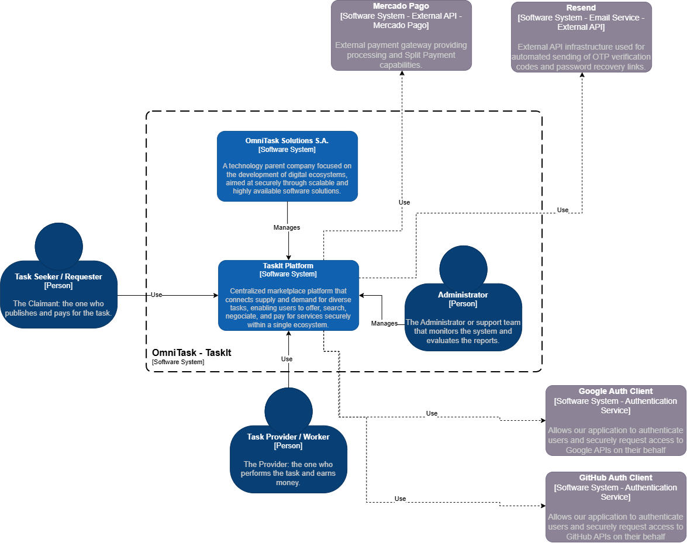

Esta es la vista de más alto nivel, la de todo el ecosistema TaskIt y no solo de este microservicio. Muestra a los tres actores humanos —Task Seeker, Task Provider y Administrador— interactuando con la plataforma, junto a las dos integraciones externas de negocio: Mercado Pago para pagos y Resend para el envío de códigos OTP y recuperación de contraseña. Sirve para ubicar a Authentication & Profile dentro de algo más grande que él mismo.

### 2. Despliegue general de TaskIt

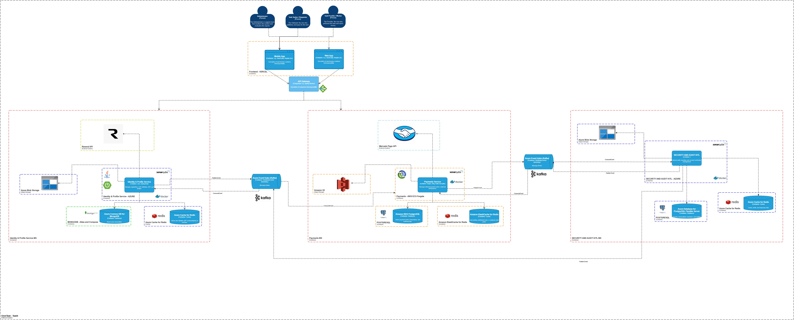

Zoom hacia los contenedores desplegados sobre Azure: el frontend en Vercel, un API Gateway y los tres microservicios de backend —Identity & Profile Service, Payments y Security and Audit HITL—. Cada uno con su propia base de datos y su propia caché, comunicándose entre sí exclusivamente a través de Azure Event Hubs. Este es el mapa de referencia para entender dónde encaja este repositorio dentro del sistema completo.

### 3. Despliegue específico de Identity & Profile Service

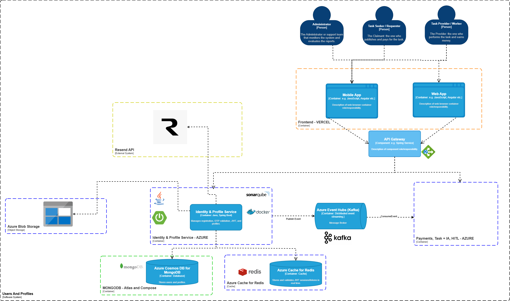

Ahora el zoom es sobre este microservicio en particular: el contenedor Spring Boot dentro de Docker, su conexión a MongoDB Atlas como fuente de verdad, Azure Cache for Redis para OTP y tokens de sesión, Azure Blob Storage para fotos y documentos, su publicación y consumo en Azure Event Hubs, y las llamadas salientes a Resend y a los proveedores de OAuth. GitHub se sumó como proveedor de login después de dibujar este diagrama, así que hoy la lista de proveedores de OAuth es más larga que la que verás aquí.

### 4. Componentes internos

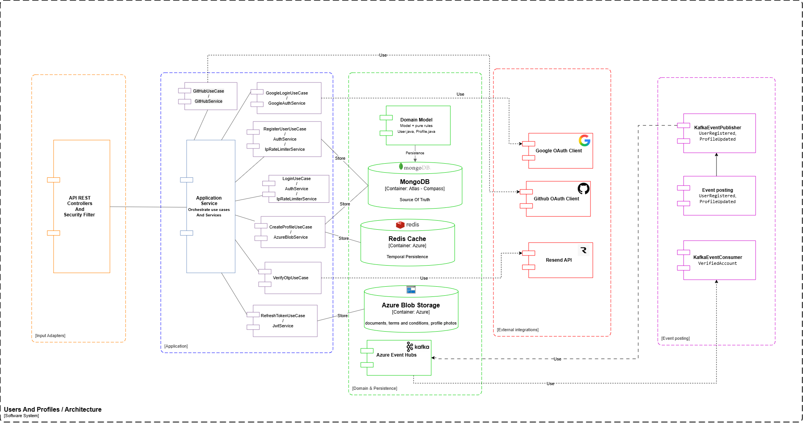

Aquí se abre el contenedor Spring Boot y se muestra cómo se reparte la responsabilidad puertas adentro, siguiendo la arquitectura hexagonal descrita arriba. De izquierda a derecha: los controladores REST y el filtro de seguridad como adaptadores de entrada, el Application Service que orquesta los casos de uso, el dominio con su persistencia, y a la derecha el publicador y consumidor de eventos de Kafka. Es la traducción visual directa de la carpeta `application/usecases/`.

### 5. Modelo de dominio

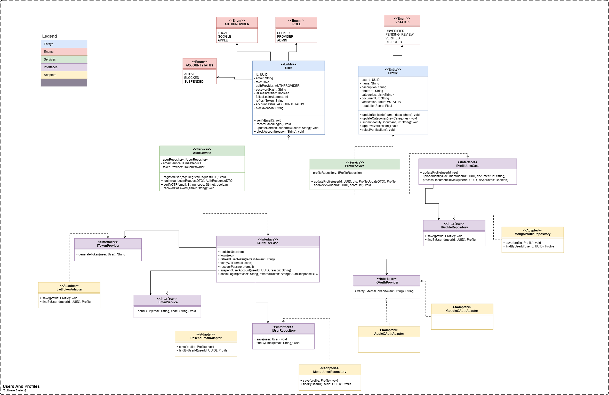

Diagrama de clases de las entidades `User` y `Profile`, sus enums, los servicios de aplicación y los puertos con sus adaptadores concretos. Documenta el diseño original del dominio. En el código actual, la reputación y los reportes se independizaron en sus propias entidades, `Review` y `Report`, en vez de vivir como métodos dentro de `Profile`, y los puertos se implementaron como interfaces de Spring Data en lugar de adaptadores manuales. El diagrama sigue siendo la referencia conceptual de para qué existe cada pieza, aunque el código haya evolucionado un paso más allá de él.

<br/>

## 📂 Estructura de carpetas: clean y hexagonal

```
src/main/java/com/omnitask/AuthAndProfiles
│
├── domain                          Núcleo del sistema, sin dependencias de frameworks
│   ├── models                      User, Profile, Review, Report
│   ├── enums                       Role, AccountStatus, VerificationStatus, ReportStatus, AuthProvider
│   ├── exceptions                  NotFoundException, ConflictException, AccountRestrictedException
│   ├── policies                    AccountAccessPolicy y otras reglas de negocio puras
│   ├── events                      Contratos de eventos y catálogo de topics
│   └── ports/out                   Interfaces que la infraestructura debe implementar
│
├── application                     Casos de uso que orquestan domain y los puertos
│   ├── usecases                    RegisterUserUseCase, LoginUseCase, CreateReviewUseCase y demás
│   └── services                    JwtService, ReputationService, AzureBlobService, GithubAuthService
│
└── infrastructure                  El único lugar que conoce el framework
    ├── adapters
    │   ├── in/web                  Controladores REST y sus DTOs de entrada y salida
    │   ├── in/kafka                Consumidor de eventos de Security and Audit HITL
    │   ├── out/mongo                Repositorios de Spring Data
    │   ├── out/kafka                Patrón outbox: guardar, reintentar, publicar
    │   └── out/resend               Envío de correos con el código OTP
    ├── security                     Filtro JWT y reglas de propiedad de perfil
    ├── messaging                    Sobre común de los eventos
    └── config                       Seguridad, Kafka, creación del administrador inicial
```

> **Regla de dependencia:** `domain` no importa nada de `infrastructure`. `application` solo conoce `domain` y los puertos. `infrastructure` es la única capa que importa Spring, el driver de Mongo, el SDK de Azure o el cliente de Kafka.

<br/>

## 🌐 API Endpoints

Prefijo común para todo: `/api/v1`. Autenticación por **JWT Bearer** salvo donde se indique explícitamente público.

### Registro y sesión — `/auth`

| Método | Ruta | Acceso | Qué hace |
|---|---|---|---|
| `POST` | `/auth/register` | público | Registra un Seeker o un Provider, nunca un Admin, y dispara el envío del OTP |
| `POST` | `/auth/verify-otp` | público | Verifica el código OTP, con un máximo de cinco intentos, y activa la cuenta |
| `POST` | `/auth/resend-otp` | público | Reenvía un nuevo código OTP |
| `POST` | `/auth/login` | público | Login con email y contraseña, con límite de intentos por dirección IP |
| `POST` | `/auth/refresh` | público | Renueva el access token a partir de un refresh token vigente |
| `POST` | `/auth/google` | público | Login o registro con Google, a partir de un ID token |
| `POST` | `/auth/github` | público | Login o registro con GitHub, a partir del código de autorización |

### Perfil, reputación y reportes — `/profiles`

| Método | Ruta | Acceso | Qué hace |
|---|---|---|---|
| `GET` | `/profiles/{userId}` | autenticado | Perfil público, sin exponer datos sensibles |
| `GET` | `/profiles/search?name=` | autenticado | Búsqueda de perfiles por nombre |
| `POST` | `/profiles/{userId}/photo` | dueño del perfil | Sube la foto de perfil al contenedor público de Azure Blob |
| `POST` | `/profiles/{userId}/document` | dueño del perfil | Envía el documento de identidad a verificación, en el contenedor privado |
| `PATCH` | `/profiles/{userId}` | dueño del perfil | Actualiza descripción, categorías, ubicación y foto |
| `POST` | `/profiles/switch-role` | el propio usuario | Cambia entre Seeker y Provider |
| `DELETE` | `/profiles/{email}` | dueño o Admin | Elimina la cuenta y su perfil, incluido el documento almacenado |
| `POST` | `/profiles/{userId}/reports` | autenticado | Reporta un perfil; suspende automáticamente al alcanzar el umbral configurado |

### Calificaciones — `/reviews`

| Método | Ruta | Acceso | Qué hace |
|---|---|---|---|
| `POST` | `/reviews` | autenticado | Registra una calificación de uno a cinco por una tarea y recalcula la reputación |
| `GET` | `/reviews/user/{userId}` | autenticado | Reseñas recibidas por un usuario, paginadas |

### Administración — solo rol Admin

| Método | Ruta | Qué hace |
|---|---|---|
| `GET` | `/admin/users?status=&q=&page=&size=` | Lista usuarios, sin exponer el hash de contraseña |
| `PATCH` | `/admin/users/{userId}/status` | Suspende, bloquea o reactiva una cuenta |
| `GET` | `/admin/verification-documents/{userId}/access` | Enlace temporal de solo lectura al documento de identidad, vigente unos diez minutos |
| `POST` | `/admin/verification-documents/{userId}/resolution` | Aprueba o rechaza una verificación, mientras HITL no esté integrado |
| `GET` | `/admin/reports?status=&page=&size=` | Lista reportes de usuarios |
| `PATCH` | `/admin/reports/{reportId}/status` | Resuelve o descarta un reporte |

<br/>

## 📤 Datos de entrada y salida

Todo error, sin importar el endpoint, responde con este mismo formato desde `GlobalExceptionHandler`:

```json
{
  "timestamp": "2026-09-22T10:15:00",
  "status": 404,
  "error": "No encontrado",
  "message": "Usuario no encontrado"
}
```

| Código HTTP | Excepción de dominio | Cuándo ocurre |
|---|---|---|
| `400` | `IllegalArgumentException` | Falla una validación de negocio |
| `401` | `AuthenticationFailedException` | Credenciales o token inválidos |
| `403` | `AccountRestrictedException` o `AccessDeniedException` | Cuenta suspendida, bloqueada o sin permiso |
| `404` | `NotFoundException` | El usuario, perfil o reporte no existe |
| `409` | `ConflictException` | Reseña o reporte duplicados |
| `429` | `TooManyAttemptsException` | Se superó el límite de intentos de login o de OTP |
| `502` | `ExternalServiceException` | Falló Resend, Azure Blob, Google o GitHub |
| `500` | Sin excepción de dominio | Cualquier error no controlado, sin exponer detalle interno |

### Ejemplos principales

<details>
<summary><code>POST /api/v1/auth/register</code></summary>

```json
{
  "email": "usuario@gmail.com",
  "password": "Password1!",
  "name": "Robinson Núñez",
  "role": "SEEKER",
  "acceptedTerms": true
}
```

Responde `201` con un mensaje pidiendo verificar el correo con el código OTP enviado.
</details>

<details>
<summary><code>POST /api/v1/auth/login</code></summary>

```json
{ "email": "usuario@gmail.com", "password": "Password1!" }
```

Responde `200` con `accessToken`, `refreshToken`, un mensaje y el email.
</details>

<details>
<summary><code>GET /api/v1/profiles/{userId}</code></summary>

```json
{
  "userId": "66f1...",
  "fullName": "Robinson Núñez",
  "description": "Desarrollador full stack",
  "photoUrl": "https://...blob.core.windows.net/profiles-photos/....png",
  "categories": ["desarrollo-web", "diseño"],
  "locationCoverage": "Bogotá",
  "reputationScore": 4.67,
  "totalReviews": 12,
  "identityVerificationStatus": "VERIFIED"
}
```

Nunca incluye el nombre del blob del documento de identidad. Ese dato es sensible y solo lo puede pedir un administrador a través del endpoint de acceso temporal.
</details>

<details>
<summary><code>POST /api/v1/reviews</code></summary>

```json
{ "taskId": "task-123", "revieweeId": "66f1...", "rating": 5, "comment": "Excelente trabajo" }
```

Responde `201` con la reseña creada, incluido su `id` y su `createdAt`.
</details>

<details>
<summary><code>PATCH /api/v1/admin/users/{userId}/status</code></summary>

```json
{ "status": "SUSPENDED", "reason": "Tres reportes acumulados por incumplimiento" }
```

Responde `200` con el usuario actualizado, sin su hash de contraseña.
</details>

<br/>

## 🔗 Integración con microservicios

Este servicio habla con el resto de TaskIt de forma **asíncrona**, a través de Azure Event Hubs sobre el protocolo Kafka, con el patrón outbox del lado de publicación para no perder eventos si el broker está caído.

### 📢 Lo que publica — `taskit.auth.events` y `taskit.auth.audit`

| Evento | Cuándo se dispara | A quién le importa |
|---|---|---|
| `UserRegistered` | Alta de cuenta, sea local, con Google o con GitHub | Task Service y analítica |
| `IdentityDocumentSubmitted` | El usuario sube su documento de identidad | Security & Audit HITL, para iniciar la revisión |
| `IdentityVerificationUpdated` | Se aprueba o rechaza una verificación | Task Service, para elegibilidad de tareas |
| `AccountStatusChanged` | Suspensión, bloqueo o reactivación | Task Service y Payments |
| `AccountDeleted` | Se elimina una cuenta | Todos los microservicios, para limpiar datos relacionados |
| `ReviewCreated` y `ReputationUpdated` | Se registra o recalcula una calificación | Task Service, para mostrar reputación |
| `UserReported` | Un usuario reporta a otro | Security & Audit HITL, para su cola de moderación |
| `SecurityAudit` | Login exitoso, fallido o bloqueado, o acceso a un documento | Security & Audit |

### 📥 Lo que consume — `taskit.security.events`

| Evento | Origen | Efecto en este servicio |
|---|---|---|
| `IdentityVerificationResolved` | Security & Audit HITL | Marca el perfil como verificado o rechazado |
| `AccountSanctionApplied` | Security & Audit HITL | Suspende, bloquea o reactiva la cuenta sancionada |

El contrato completo, con cada payload en JSON, el sobre común de todos los eventos, la configuración de Event Hubs y el flujo entero de verificación de documentos con enlaces temporales firmados, vive en [`docs/eventos-y-documentos.md`](docs/eventos-y-documentos.md). Cualquier equipo que quiera integrarse con este microservicio debería empezar por ahí.

### 🤝 Integraciones síncronas con terceros

| Servicio | Para qué se usa |
|---|---|
| Resend | Envío del correo con el código OTP |
| Google OAuth | Verificación del ID token para login social |
| GitHub OAuth | Intercambio del código de autorización por un access token y lectura del perfil |
| Azure Blob Storage | Fotos de perfil en un contenedor público y documentos de identidad en uno privado |

<br/>

## 🛠️ Tecnologías

| Categoría | Elección |
|---|---|
| Lenguaje y runtime | Java 17 |
| Framework | Spring Boot 3.3.3, con Web, Security, Validation, Data MongoDB y Data Redis |
| Base de datos | MongoDB Atlas |
| Caché y control de intentos | Redis, en Azure Cache for Redis |
| Autenticación | JWT con JJWT 0.12.5 y contraseñas con BCrypt |
| Mensajería | Apache Kafka sobre Azure Event Hubs, vía Spring Kafka |
| Almacenamiento de archivos | Azure Blob Storage, SDK 12.28.1 |
| Login social | Google API Client y GitHub OAuth por REST |
| Correo | Resend |
| Documentación de API | springdoc-openapi, OpenAPI 3 y Swagger UI |
| Pruebas | JUnit 5, Mockito, AssertJ y Spring Security Test |
| Cobertura | JaCoCo |
| Contenedores | Docker, imagen multi etapa que corre como usuario sin privilegios |
| Infraestructura local | docker compose, con Kafka en modo KRaft y Redis |
| Pruebas de carga | k6 |
| Integración continua | GitHub Actions, con despliegue a Azure Web App |

<br/>

## 🌿 Estrategia de ramas

El repositorio sigue **trunk based development**. `main` está siempre desplegable y las funcionalidades nuevas viven en ramas de corta duración, con mensajes de commit que siguen la convención de **Conventional Commits**: `feat`, `fix`, `test`, `docs`, `chore`.

```
main                     Rama estable y protegida. Todo despliegue sale de aquí.
 ├── feature/<nombre>     Una funcionalidad nueva, por ejemplo feature/eventos-kafka
 ├── fix/<nombre>         Corrección de un defecto puntual
 ├── test/<nombre>        Trabajo dedicado a cobertura de pruebas
 └── docs/<nombre>        README, diagramas o cualquier documento
```

Cada rama nace de `main` y vuelve a `main` por Pull Request. Nadie hace commits directos a `main` salvo emergencia, y esa emergencia se documenta después.

Las fases grandes de este servicio —seguridad y roles, eventos con Kafka, reputación y reportes, login con GitHub— se desarrollaron cada una en su propia rama, para poder revisarlas y probarlas por separado antes de integrarlas.

<br/>

## ✅ Pruebas

### Unitarias

```bash
mvn clean test
```

La cobertura se mide con JaCoCo sobre servicios, controladores y casos de uso. Después de `mvn clean verify`, el reporte queda en `target/site/jacoco/index.html`.

#### Cobertura (JaCoCo): 100 %

El plugin de JaCoCo está configurado para medir cobertura solo sobre las clases con lógica de negocio (`*Service`, `*Controller`, `*UseCase`); quedan fuera a propósito entidades, DTOs, enums, excepciones, eventos, configuración y las interfaces de repositorio (Spring Data las implementa en runtime, no hay lógica propia que probar ahí):

```xml
<!-- JaCoCo: la cobertura solo se mide sobre clases *Service, *Controller y *UseCase -->
<includes>
    <include>**/*Service.class</include>
    <include>**/*Controller.class</include>
    <include>**/*UseCase.class</include>
</includes>
```

Con ese alcance, el estado actual es **100 % de instrucciones y 100 % de ramas** en los cuatro paquetes medidos:

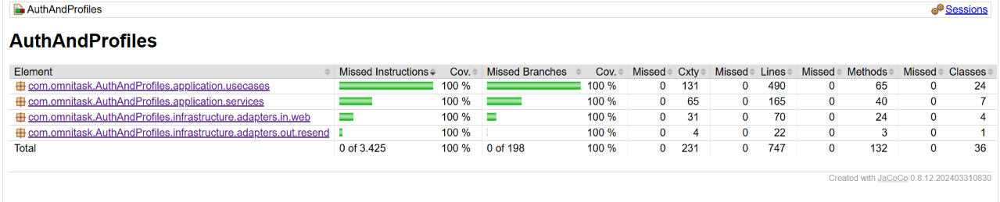

| Paquete | Instrucciones | Ramas | Clases |
|---|:---:|:---:|:---:|
| `application.usecases` | 100 % | 100 % | 24 |
| `application.services` | 100 % | 100 % | 7 |
| `infrastructure.adapters.in.web` (controladores) | 100 % | 100 % | 4 |
| `infrastructure.adapters.out.resend` | 100 % | 100 % | 1 |
| **Total** | **100 % (3 425/3 425)** | **100 % (198/198)** | **36** |

Los 24 casos de uso, uno por operación de negocio (login local, login con Google/GitHub, registro, verificación de OTP, reportes, reseñas, verificación de identidad, administración de cuentas, etc.), quedan al 100 % tanto en instrucciones como en ramas:

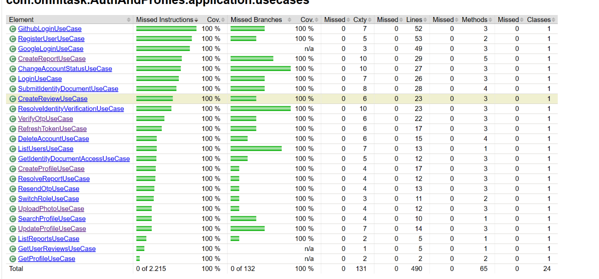

Los cuatro controladores REST (`AuthController`, `ProfileController`, `AdminController`, `ReviewController`) y el adaptador de envío de correo (`ResendEmailService`) también cierran en 100 %:

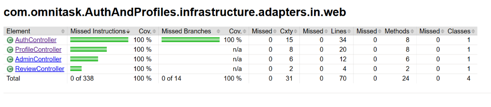

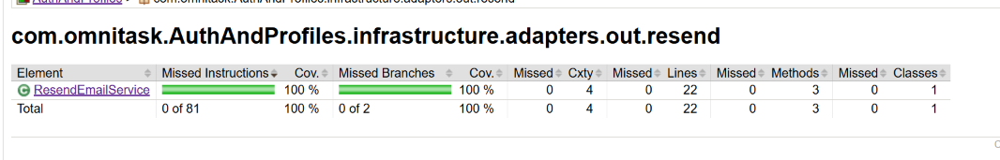

> Llegar al 100 % de ramas (no solo de instrucciones) obliga a probar explícitamente los casos límite de cada condición: valores `null` vs. cadenas en blanco, respuestas `204 No Content` de servicios externos, el operador `&&`/`||` evaluado por ambos lados, etc. — no solo el camino feliz de cada método.

### De carga

Las pruebas de carga se hacen con [k6](https://k6.io/) y la extensión `xk6-redis`. El script está en [`load-tests/auth-profile-load-test.js`](load-tests/auth-profile-load-test.js).

#### Qué se quería validar

1. **Que el flujo completo de un usuario nuevo aguanta concurrencia sin errores**: registro, verificación por OTP, login y lectura de perfil, con hasta 100 usuarios virtuales (VUs) al mismo tiempo.
2. **Que los datos no se cruzan ni se pierden bajo carga**: cada iteración usa un correo único y cada VU debe poder verificar su propio OTP y obtener su propio perfil.
3. **Los tiempos de respuesta por endpoint**, para saber cuál es el más costoso (`register` y `login` hacen hash de contraseña con BCrypt; `register` además escribe en Mongo tres veces).
4. **Que el mecanismo de seguridad se mantiene**: el OTP nunca se expone por HTTP; el script lo lee de Redis.

#### Cómo se hizo

1. Se levantó la infraestructura local (`docker compose up -d`: Kafka y Redis) y el servicio con `mvn spring-boot:run`, con `EMAIL_ENABLED=false` para no enviar correos reales a direcciones inventadas (el OTP se sigue generando y guardando en Redis).
2. Se compiló k6 con la extensión de Redis (`grafana/xk6 build --with github.com/grafana/xk6-redis`).
3. Cada VU ejecuta este flujo, con un correo único (`user_<vu>_<iter>_<timestamp>@loadtest.com`):

   | Paso | Endpoint | Cómo se valida |
   |:---:|---|---|
   | 1 | `POST /api/v1/auth/register` | Responde `201` |
   | 2 | `POST /api/v1/auth/verify-otp` | El OTP se lee de Redis (`refresh_token:otp:<email>`) y responde `200` |
   | 3 | `POST /api/v1/auth/login` | Responde `200` y trae `accessToken` |
   | 4 | `GET /api/v1/profiles/{userId}` | El `userId` se obtiene con `/profiles/search` por email; responde `200` |

4. Perfil de carga (3 min 30 s): 10 VUs (30 s) → 50 VUs (1 min) → 100 VUs (30 s) → 100 VUs sostenidos (1 min) → bajada a 0 (30 s).
5. Se ejecuta con:

   ```bash
   docker run --rm -v "${PWD}:/xk6" -w /xk6 --entrypoint /xk6/k6 \
     -e BASE_URL=http://host.docker.internal:8080 \
     -e REDIS_HOST=host.docker.internal \
     -e REDIS_PORT=6379 \
     grafana/xk6 run auth-profile-load-test.js
   ```

   Al terminar se imprime el reporte de abajo y se genera `load-test-summary.json`.

#### Resultado

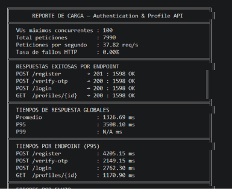

| Métrica | Valor |
|---|---:|
| VUs máximos | 100 |
| Peticiones totales | 7 990 (37.82 req/s) |
| Tasa de fallos HTTP | 0.00 % |
| Flujos completos exitosos | 1 598 de 1 598 (register, verify-otp, login y profile) |
| Tiempo promedio global | 1 326.69 ms |
| P95 global | 3 508.10 ms |

| Endpoint | P95 |
|---|---:|
| `POST /register` | 4 205.15 ms |
| `POST /verify-otp` | 2 149.15 ms |
| `POST /login` | 2 762.30 ms |
| `GET /profiles/{id}` | 1 170.90 ms |

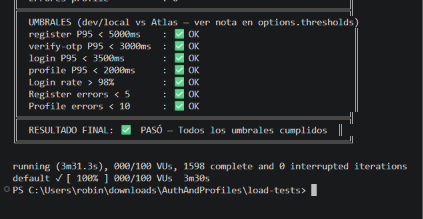

✔️ Todos los umbrales se cumplen: 100 % de éxito en login, cero errores de registro y de perfil, y P95 por debajo del techo definido para cada endpoint.

#### Qué se encontró y qué se corrigió en el camino

- **El script leía la llave de Redis equivocada.** `TokenRedisRepository` antepone `refresh_token:` a toda llave, así que el OTP real está en `refresh_token:otp:<email>`, no en `otp:<email>`. Además, xk6-redis rechaza la promesa con `redis: nil` cuando la llave no existe, lo que rompía cada iteración en vez de reintentar. Con ese error solo se completaba el registro (3 893 registros, 0 verificaciones, 0 logins).
- **Faltaban índices en Mongo.** `User.email` y `Profile.userId` se consultaban en todos los caminos críticos sin índice, por lo que ahora tienen `@Indexed(unique = true)` y `spring.data.mongodb.auto-index-creation=true`. En la prueba local no se notó mejora en los tiempos (ver la siguiente sección), pero es la configuración correcta para cualquier ambiente.
- **La búsqueda de perfil usaba el nombre**, que produce un regex sin anclar (`findByNameContainingIgnoreCase`), un escaneo completo de la colección aunque haya índice. El script ahora busca por email, que sí usa el índice.

#### Limitaciones y cómo interpretar los tiempos

> ⚠️ El objetivo original era P95 < 800 ms, y **no se cumple en esta prueba**: los tiempos de 1 a 4 s se midieron con la app y Kafka/Redis en una máquina local, hablando con un cluster de **MongoDB Atlas** remoto. Un `GET /profiles/{id}` por un campo ya indexado, que es una consulta trivial, sigue en ~1.2 s de P95, lo que apunta a que el techo lo pone el entorno de la prueba (latencia de red hacia Atlas y/o el tier del cluster) y no las consultas. Esa causa **no se confirmó** con las métricas de Atlas.

Por eso los umbrales del script son de desarrollo y por endpoint, con margen sobre lo observado:

| Umbral | Meta |
|---|---:|
| `register` P95 | < 5 000 ms |
| `verify-otp` P95 | < 3 000 ms |
| `login` P95 | < 3 500 ms |
| `profile` P95 | < 2 000 ms |
| Éxito de login | > 98 % |
| Errores de registro / perfil | < 5 / < 10 |

**Estos valores validan la corrección funcional bajo carga, no un SLA de producción.** Para validar el objetivo de 800 ms hay que repetir la prueba con la app y la base de datos en la misma región y con un tier dedicado de Atlas, y volver a exigir el umbral estricto.

No se probaron a propósito la subida de documentos (Azure Blob, por costos de almacenamiento) ni el login con Google/GitHub (dependen de OAuth externo). Más detalle en [`load-tests/README.md`](load-tests/README.md).

<br/>

## ⚙️ Configuración y despliegue

1. Copia `.env.example` a `.env` y completa cada valor: Mongo, JWT, Redis, Resend, Azure Blob, Google, GitHub y Kafka. El archivo `.env` nunca se sube al repositorio.
2. Para desarrollo local, `docker compose up -d` levanta Kafka y Redis. Con `REDIS_SSL=false` el servicio corre completo sin depender de ningún recurso de Azure.
3. Luego, `mvn spring-boot:run` levanta el servicio.

Una vez arriba, la documentación interactiva de la API queda disponible en `http://localhost:8080/swagger-ui.html`.

> Los detalles de cada variable sensible, cómo generar el `JWT_SECRET`, cómo se crea el administrador inicial y cómo configurar Azure Event Hubs están en `.env.example` y en `docs/eventos-y-documentos.md`.

<br/>

## 📚 Documentación adicional

| Documento | Contenido |
|---|---|
| [`docs/eventos-y-documentos.md`](docs/eventos-y-documentos.md) | Contrato completo de eventos de Kafka y el flujo de verificación de documentos |
| [`load-tests/README.md`](load-tests/README.md) | Cómo correr y leer la prueba de carga con k6 |
| [`PROMPTS.md`](PROMPTS.md) | Guía de los prompts usados en cada fase de este proyecto, pensada para que otro equipo pueda seguir el mismo camino al construir un microservicio parecido |

